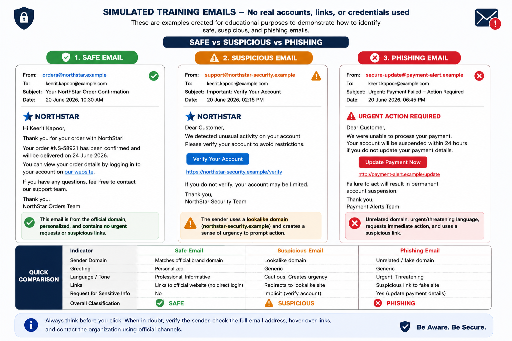
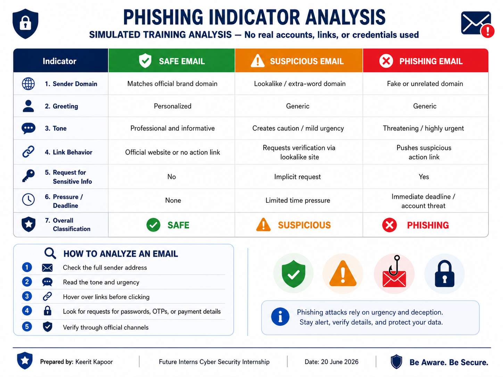

# Phishing Email Detection & Awareness System

## Future Interns Cyber Security Internship

**Prepared by:** Keerit Kapoor
**Task:** Task 2 – Phishing Email Detection & Awareness System
**Date:** 20 June 2026

---

## Project Overview

This project demonstrates how to identify and classify email-based threats using simulated examples of safe, suspicious, and phishing emails.

The purpose is to help users recognise common warning signs such as fake sender domains, urgent language, suspicious links, generic greetings, and requests for sensitive information.

> **Disclaimer:** All examples, domains, links, and messages in this repository are simulated for educational purposes only. No real accounts, passwords, or credentials were used.

---

## Objective

* Identify common phishing indicators.
* Classify emails as Safe, Suspicious, or Phishing.
* Explain the risks in simple language.
* Provide practical awareness guidance to help users avoid phishing attacks.

---

## Email Classification Summary

| Example                      | Classification | Key Indicators                                            |
| ---------------------------- | -------------- | --------------------------------------------------------- |
| NorthStar order confirmation | Safe           | Personalised, clear information, no urgent request        |
| Account verification notice  | Suspicious     | Lookalike domain, generic greeting, urgency               |
| Payment update warning       | Phishing       | Fake sender domain, threatening language, suspicious link |

---

## Evidence 1: Simulated Email Comparison



This comparison explains the differences between a legitimate-looking email, a suspicious email, and a phishing email.

### Safe Email Indicators

* Sender domain matches the organisation.
* Message is personalised and informative.
* No urgent action is demanded.
* No request for passwords, OTPs, or payment information.

### Suspicious Email Indicators

* Sender uses a lookalike or unusual domain.
* Message uses a generic greeting.
* Creates mild urgency, such as asking to verify an account.
* Encourages the user to click a link.

### Phishing Email Indicators

* Sender domain is fake or unrelated.
* Message uses urgent or threatening language.
* Requests sensitive information or payment details.
* Includes a suspicious action link.

---

## Evidence 2: Phishing Indicator Analysis



The image above analyses key indicators that should be checked before trusting an email.

| Indicator             | What to Check                                                         |
| --------------------- | --------------------------------------------------------------------- |
| Sender Address        | Check the complete sender email address and domain                    |
| Urgency               | Be cautious of threats, deadlines, or pressure to act immediately     |
| Links                 | Hover over links and verify the real destination                      |
| Greeting              | Generic greetings may require extra caution                           |
| Attachments           | Do not open unexpected files or invoices                              |
| Sensitive Information | Never share passwords, OTPs, or payment details by email              |
| Overall Quality       | Watch for poor grammar, strange formatting, and inconsistent branding |

---

## Prevention Guidelines

* Verify the full sender email address before replying or clicking anything.
* Do not trust urgent or threatening messages automatically.
* Hover over links to inspect the destination before opening them.
* Never share passwords, OTPs, banking details, or payment information by email.
* Do not open unexpected attachments.
* Access accounts through official apps, bookmarks, or manually typed website addresses.
* Use multi-factor authentication whenever possible.
* Report suspicious emails to your organisation or email provider.

---

## Repository Structure

```text
FUTURE_CS_02/
│
├── README.md
│
└── screenshots/
    ├── phishing_email_examples.png
    └── phishing_email_analysis_guide.png
```

---

## Skills Demonstrated

* Phishing email detection
* Sender-domain verification
* Suspicious-link awareness
* Risk classification
* Cybersecurity awareness communication
* GitHub documentation

## Full Report

[Open the full Phishing Detection & Awareness Report](Phishing_Detection_Awareness_Report_Keerit_Kapoor.pdf)

---

## Conclusion

Phishing attacks often rely on urgency, deception, and trust. Users can reduce risk by verifying senders carefully, avoiding unexpected links and attachments, and using official channels to access important accounts.

Awareness is one of the strongest defences against phishing.

